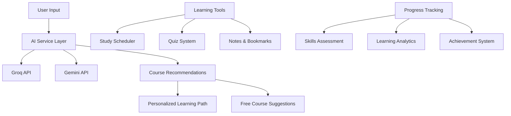
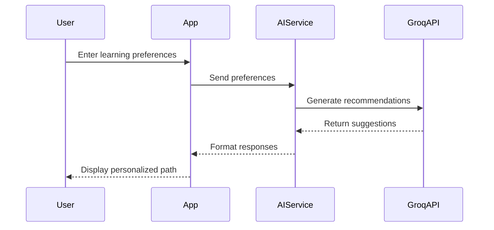
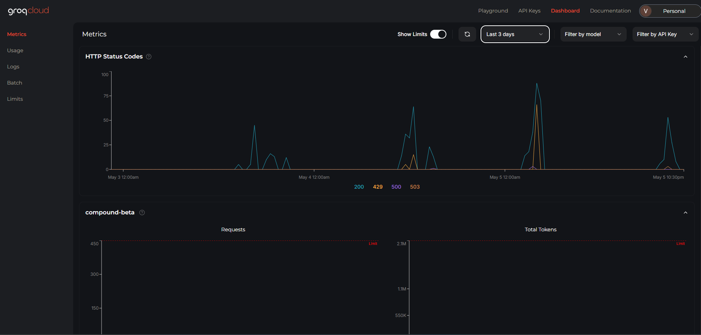
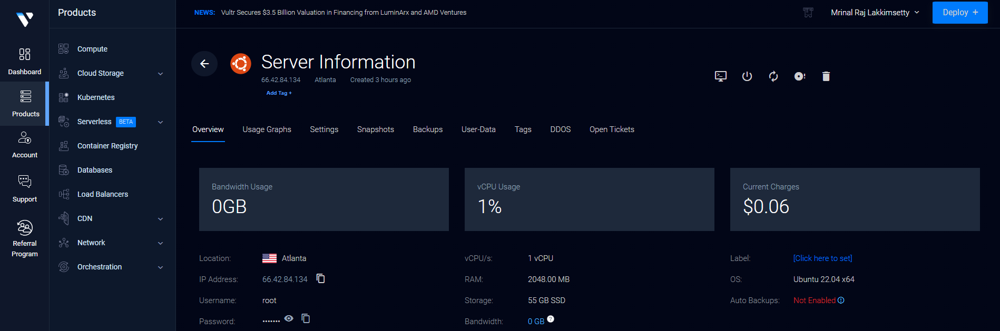

# Study Synergy Loop

A modern learning platform with personalized AI-powered course recommendations, free course suggestions, and productivity tools.

## 🔄 System Overview



## 🎯 Core Features

### Learning Management
- **Personalized Dashboard**: Track enrolled courses, completion rates, learning time, and acquired skills
- **Progress Analytics**: Visual progress indicators and detailed learning statistics
- **Skill Tracking**: Monitor and update skill levels as you learn

### Study Tools
- **Interactive Scheduler**: Plan study sessions and track learning streaks
- **Quiz System**: Test knowledge with AI-generated quizzes
- **Notes & Bookmarks**: Save and organize learning materials
- **Study Groups**: Collaborate with other learners

### AI Integration


### Learning Assistant
- **LoopBot**: AI-powered chat assistant for instant help
- **Course Suggestions**: Get relevant course recommendations

## ✨ AI-Powered Features (Groq)

- **Personalized Learning Path:**
  - Enter your topic, experience, duration, and goal.
  - Get a custom learning path and 4 AI-recommended courses, powered by Groq.
  - No star ratings are shown for these AI recommendations—just clear, actionable suggestions.

- **Free Udemy Course Suggestions:**
  - Groq AI suggests 4 free Udemy courses for your chosen topic.
  - Each course includes title, description, instructor, and star ratings for popularity and quality.
  - Stars are shown based on the AI's assessment of course popularity and rating.

## 🔍 User Experience Flow


## Running the Groq Server

The application uses a Groq proxy server to handle AI-powered recommendations securely. Follow these steps to run the server:

### Prerequisites
1. Obtain a Groq API key from [Groq Cloud](https://console.groq.com)
2. Set up your environment variable:
```sh
# Create a .env file in the root directory
GROQ_API_KEY=your_api_key_here
```

### Starting the Server
Run the Groq server using:
```sh
npm run groq:server
```

### API Endpoints
The Groq server exposes the following endpoint:

| Endpoint | Method | Description |
|----------|---------|-------------|
| `/api/groq` | POST | Main endpoint for AI-powered features |

The endpoint handles the following operations:
- Course Recommendations
- Learning Path Generation
- Quiz Generation
- Skill Assessment

All requests require authentication via the Groq API key.

The server will start on port 4001 by default. You can modify the port by setting the `PORT` environment variable.

### Server Details
- **Endpoint**: POST `/api/groq`
- **Port**: 4001 (default)
- **CORS**: Enabled for cross-origin requests
- **Authentication**: Requires Groq API key in environment variables

## 📸 Media

### Screenshots

#### AI-Powered Learning

*The platform leverages Groq's AI capabilities for personalized learning recommendations*

#### Deployment Options

*Deploy your learning environment on Vultr cloud infrastructure*

### Video Demos

#### Feature Overview
<video width="100%" controls>
  <source src="public/demos/feature-overview.mp4" type="video/mp4">
  Your browser does not support the video tag.
</video>

#### AI Assistant Demo
<video width="100%" controls>
  <source src="public/demos/ai-assistant-demo.mp4" type="video/mp4">
  Your browser does not support the video tag.
</video>