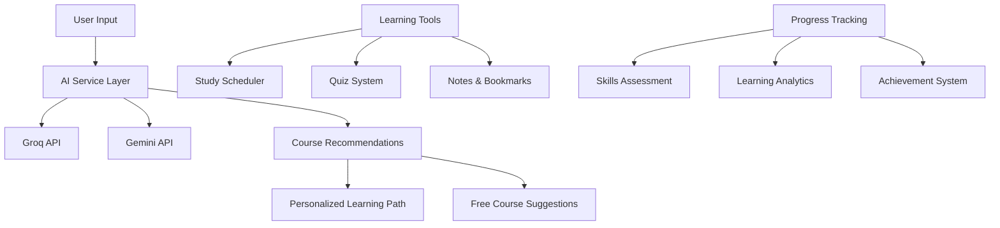
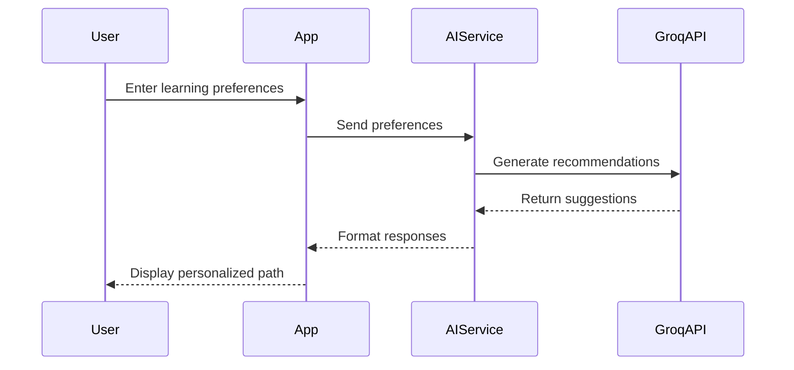
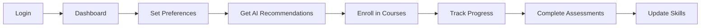

# Study Synergy Loop

A modern learning platform with personalized AI-powered course recommendations, free course suggestions, and productivity tools.

## 🔄 System Overview



## 🎯 Core Features

### Learning Management
- **Personalized Dashboard**: Track enrolled courses, completion rates, learning time, and acquired skills
- **Progress Analytics**: Visual progress indicators and detailed learning statistics
- **Skill Tracking**: Monitor and update skill levels as you learn

### Study Tools
- **Interactive Scheduler**: Plan study sessions and track learning streaks
- **Quiz System**: Test knowledge with AI-generated quizzes
- **Notes & Bookmarks**: Save and organize learning materials
- **Study Groups**: Collaborate with other learners

### AI Integration


### Learning Assistant
- **LoopBot**: AI-powered chat assistant for instant help
- **Course Suggestions**: Get relevant course recommendations

## ✨ AI-Powered Features (Groq)

- **Personalized Learning Path:**
  - Enter your topic, experience, duration, and goal.
  - Get a custom learning path and 4 AI-recommended courses, powered by Groq.
  - No star ratings are shown for these AI recommendations—just clear, actionable suggestions.

- **Free Udemy Course Suggestions:**
  - Groq AI suggests 4 free Udemy courses for your chosen topic.
  - Each course includes title, description, instructor, and star ratings for popularity and quality.
  - Stars are shown based on the AI's assessment of course popularity and rating.

## 🔍 User Experience Flow



## Running the Groq Server

The application uses a Groq proxy server to handle AI-powered recommendations securely. Follow these steps to run the server:

### Prerequisites
1. Obtain a Groq API key from [Groq Cloud](https://console.groq.com)
2. Set up your environment variable:
```sh
# Create a .env file in the root directory
GROQ_API_KEY=your_api_key_here
```

### Starting the Server
Run the Groq server using:
```sh
npm run groq:server
```

### API Endpoints
```mermaid
graph LR
    A[Client] --> B[/api/groq]
    B --> C[Course Recommendations]
    B --> D[Learning Path Generation]
    B --> E[Quiz Generation]
    B --> F[Skill Assessment]
```

The server will start on port 4001 by default. You can modify the port by setting the `PORT` environment variable.

### Server Details
- **Endpoint**: POST `/api/groq`
- **Port**: 4001 (default)
- **CORS**: Enabled for cross-origin requests
- **Authentication**: Requires Groq API key in environment variables

## Project info

**URL**: https://lovable.dev/projects/f754e6a0-18e5-4312-a9d2-57650e6add7a

## How can I edit this code?

There are several ways of editing your application.

**Use Lovable**

Simply visit the [Lovable Project](https://lovable.dev/projects/f754e6a0-18e5-4312-a9d2-57650e6add7a) and start prompting.

Changes made via Lovable will be committed automatically to this repo.

**Use your preferred IDE**

If you want to work locally using your own IDE, you can clone this repo and push changes. Pushed changes will also be reflected in Lovable.

The only requirement is having Node.js & npm installed - [install with nvm](https://github.com/nvm-sh/nvm#installing-and-updating)

Follow these steps:

```sh
# Step 1: Clone the repository using the project's Git URL.
git clone <YOUR_GIT_URL>

# Step 2: Navigate to the project directory.
cd <YOUR_PROJECT_NAME>

# Step 3: Install the necessary dependencies.
npm i

# Step 4: Start the development server with auto-reloading and an instant preview.
npm run dev
```

**Edit a file directly in GitHub**

- Navigate to the desired file(s).
- Click the "Edit" button (pencil icon) at the top right of the file view.
- Make your changes and commit the changes.

**Use GitHub Codespaces**

- Navigate to the main page of your repository.
- Click on the "Code" button (green button) near the top right.
- Select the "Codespaces" tab.
- Click on "New codespace" to launch a new Codespace environment.
- Edit files directly within the Codespace and commit and push your changes once you're done.

## What technologies are used for this project?

This project is built with:
- Vite
- TypeScript
- React
- shadcn-ui
- Tailwind CSS
- Groq (for AI recommendations)

## How can I deploy this project?

Simply open [Lovable](https://lovable.dev/projects/f754e6a0-18e5-4312-a9d2-57650e6add7a) and click on Share -> Publish.

## I want to use a custom domain - is that possible?

We don't support custom domains (yet). If you want to deploy your project under your own domain then we recommend using Netlify. Visit our docs for more details: [Custom domains](https://docs.lovable.dev/tips-tricks/custom-domain/)

## 🍏 Apple-Inspired Animated Notifications

This app uses a custom AnimatedToaster notification system with Framer Motion for beautiful, Mac-like bounce and pop effects. Notifications appear in the top-right with glassmorphism, shadow, and smooth transitions.

- Trigger notifications anywhere using the `useAnimatedToaster` hook and `showToast` function.
- Example:
  ```tsx
  const { showToast } = useAnimatedToaster();
  showToast({ type: "success", title: "Welcome!", message: "You have logged in." });
  ```
- Login/logout and other key actions are animated for a delightful user experience.

### Custom Animation
- Notification entrance: bounce-in
- Icon: pop-in
- Fully responsive and dark mode ready

### How to Customize
- Edit `src/components/ui/AnimatedToaster.tsx` for logic and style.
- Animation CSS is in `src/index.css`.
- Place the `<AnimatedToaster toasts={toasts} />` component at the root of your app.

## Sample Login Credentials
```sh
Email: abc@gmail.com
Password: abc@gmail.com
```


Here is a rewritten version of the README.md file for a web application on a Dev Platform:


# Dev Platform Web Application

A modern web application for developers to build, deploy, and manage their projects.

## Overview

This web application provides a comprehensive platform for developers to create, deploy, and manage their projects. With a user-friendly interface and robust features, developers can focus on writing code and bringing their ideas to life.

## Features

- **Project Management**: Create and manage projects with ease, including setting up repositories, tracking progress, and collaborating with team members.
- **Code Editor**: Write, edit, and debug code with a feature-rich code editor, including syntax highlighting, auto-completion, and code refactoring.
- **Deployment**: Deploy projects to a variety of platforms, including cloud providers, containerization services, and more.
- **Collaboration**: Invite team members to collaborate on projects, with features like real-time commenting, @mentions, and task assignment.
- **Version Control**: Manage code changes with a built-in version control system, including commit history, branching, and merging.

## Getting Started

To get started with the Dev Platform web application, follow these steps:

1. **Sign Up**: Create an account on the Dev Platform website.
2. **Create a Project**: Click on the "Create Project" button to start a new project.
3. **Set up Repository**: Set up a repository for your project, either by creating a new one or linking an existing one.
4. **Start Coding**: Start writing code in the code editor, and use the platform's features to manage your project.

## Contributing

Contributions to the Dev Platform web application are welcome! If you'd like to contribute, please follow these steps:

1. **Fork the Repository**: Fork the Dev Platform repository on GitHub.
2. **Create a Branch**: Create a new branch for your feature or bug fix.
3. **Make Changes**: Make changes to the code, including writing tests and documentation.
4. **Submit a Pull Request**: Submit a pull request to the Dev Platform repository.

## Support

If you need help with the Dev Platform web application, please visit our support page. We also have a community forum where you can ask questions and get help from other developers.

## License

The Dev Platform web application is licensed under the MIT License.

## Technologies Used

This project is built with:

- Vite
- TypeScript
- React
- shadcn-ui
- Tailwind CSS
- Groq (for AI recommendations)

Note that I've kept the same structure and some of the same content as the original README.md file, but rewritten it to focus on a web application for a Dev Platform. Let me know if you'd like me to make any changes!
```

## About
This project crafted with LoveableAI, Amazon Q, Groq Cloud. You can modify and extend it as needed for your own learning or development goals.